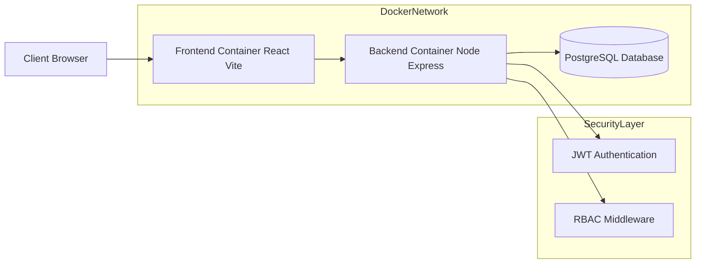
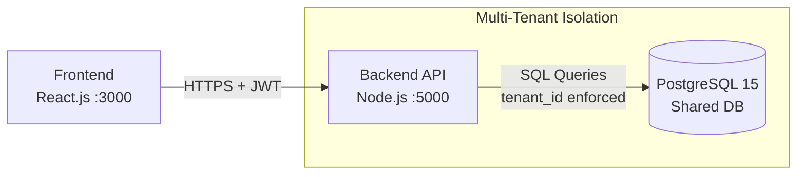
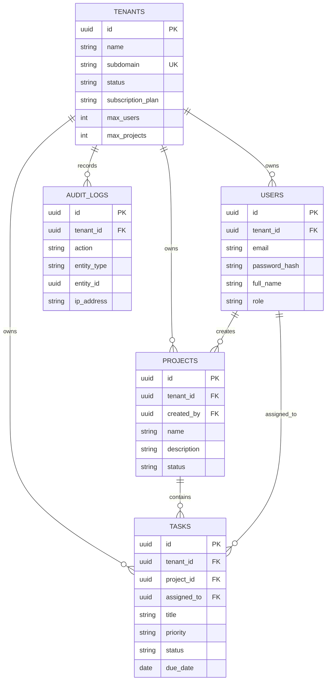

# System Architecture Document

**Project Name:** Multi-Tenant SaaS Project Management System  
**Date:** October 26, 2025  
**Version:** 1.0  
**Author:** AWS Student / Lead Developer

---

## 1. System Architecture Design

The system follows a **containerized three-tier web architecture** designed for modularity, scalability, and tenant isolation.  
The entire stack is orchestrated using **Docker Compose**, ensuring environment consistency across development and production.

---

## High-Level Architecture Diagram


## System Architecture & Components

The system follows a **multi-tenant, containerized architecture** with a clear separation between the **frontend**, **backend**, and **database** layers.

---

## Components Description

### Client Layer (Frontend)

- **Technology:** React.js (Vite Build Tool)
- **Container Port:** `3000 (External) → 3000 (Internal)`
- **Responsibilities:**
  - Renders the user interface
  - Handles user interactions
  - Manages authentication state (JWT storage)
  - Communicates with the Backend API
- **Multi-Tenancy:**
  - Tenant context is identified via:
    - Subdomain (e.g., `tenant1.app.com`), or
    - Login form input

---

### Application Layer (Backend API)

- **Technology:** Node.js, Express.js
- **Container Port:** `5000 (External) → 5000 (Internal)`
- **Responsibilities:**
  - Business logic execution
  - Authentication (JWT)
  - Authorization (RBAC)
  - Tenant isolation enforcement
- **Isolation Mechanism:**
  - Middleware extracts `tenant_id` from the JWT
  - Injects `tenant_id` into the database query context
  - Ensures strict tenant-level data isolation

---

### Data Layer (Database)

- **Technology:** PostgreSQL 15
- **Container Port:** `5432 (External) → 5432 (Internal)`
- **Responsibilities:**
  - Persistent relational data storage
- **Isolation Strategy:**
  - **Shared Database, Shared Schema**
  - Logical isolation using the `tenant_id` discriminator column
  - `tenant_id` exists in all tenant-owned tables

---

## High-Level System Architecture (Mermaid)



## Database Schema Design (ERD)

The database schema is normalized to **Third Normal Form (3NF)** to eliminate redundancy and ensure data integrity.

The `tenant_id` column acts as the **logical partition key** for multi-tenancy, enabling secure data isolation within a **shared database, shared schema** model.



## Schema Details

### `tenants` (Root Entity)
- **Primary Key:** `id (UUID)`
- **Data:**
  - `name`
  - `subdomain` (Unique)
  - `status`
  - `subscription_plan`
- **Constraints:**
  - `max_users`
  - `max_projects`
- **Isolation:**
  - Root table (no `tenant_id` column)

---

### `users`
- **Primary Key:** `id (UUID)`
- **Foreign Key:**
  - `tenant_id → tenants.id` (`ON DELETE CASCADE`) **[ISOLATION KEY]**
- **Data:**
  - `email`
  - `password_hash`
  - `full_name`
  - `role`
- **Constraint:**
  - `UNIQUE (tenant_id, email)`  
    (Emails are unique per tenant)

---

### `projects`
- **Primary Key:** `id (UUID)`
- **Foreign Keys:**
  - `tenant_id → tenants.id` (`ON DELETE CASCADE`) **[ISOLATION KEY]**
  - `created_by → users.id`
- **Data:**
  - `name`
  - `description`
  - `status`
- **Index:**
```sql
CREATE INDEX idx_projects_tenant ON projects(tenant_id);
```

### `tasks`
- **Primary Key:** `id (UUID)`
- **Foreign Keys:**
  - `project_id → projects.id` (`ON DELETE CASCADE`)
  - `tenant_id → tenants.id` **[ISOLATION KEY]**
  - `assigned_to → users.id` (Nullable)
- **Data:**
  - `title`
  - `priority`
  - `status`
  - `due_date`
- **Index:**
```sql
CREATE INDEX idx_tasks_tenant ON tasks(tenant_id);
```

### `audit_logs`
- **Primary Key:** `id (UUID)`
- **Foreign Key:**
  - `tenant_id → tenants.id` **[ISOLATION KEY]**
- **Data:**
  - `action`
  - `entity_type`
  - `entity_id`
  - `ip_address`

---

## API Architecture

The application exposes **19 RESTful endpoints** following standard REST principles.

### Standard API Response Format

All API responses follow a consistent structure:

```json
{
  "success": true,
  "message": "Operation completed successfully",
  "data": {}
}
```

### Module A: Authentication

| Method | Endpoint | Description | Authentication Required | Role |
|-------:|----------|-------------|--------------------------|------|
| POST | `/api/auth/register-tenant` | Register new organization and tenant admin | No | Public |
| POST | `/api/auth/login` | Login and receive JWT | No | Public |
| GET | `/api/auth/me` | Get current user context | Yes | Any |
| POST | `/api/auth/logout` | Invalidate user session | Yes | Any |

### Module B: Tenant Management

| Method | Endpoint | Description | Authentication Required | Role |
|-------:|----------|-------------|--------------------------|------|
| GET | `/api/tenants` | List all tenants (System Admin) | Yes | `super_admin` |
| GET | `/api/tenants/:tenantId` | Get specific tenant details | Yes | `super_admin` or `owner` |
| PUT | `/api/tenants/:tenantId` | Update tenant settings or subscription | Yes | `super_admin` or `tenant_admin` |

### Module C: User Management

| Method | Endpoint | Description | Authentication Required | Role |
|-------:|----------|-------------|--------------------------|------|
| POST | `/api/tenants/:tenantId/users` | Create a new user within a tenant | Yes | `tenant_admin` |
| GET | `/api/tenants/:tenantId/users` | List all users in a tenant | Yes | Any tenant member |
| PUT | `/api/users/:userId` | Update user profile or role | Yes | `tenant_admin` or Self |
| DELETE | `/api/users/:userId` | Remove user from tenant | Yes | `tenant_admin` |

### Module D: Project Management

| Method | Endpoint | Description | Authentication Required | Role |
|-------:|----------|-------------|--------------------------|------|
| POST | `/api/projects` | Create a new project | Yes | Any tenant member |
| GET | `/api/projects` | List projects (scoped to tenant) | Yes | Any tenant member |
| PUT | `/api/projects/:projectId` | Update project details | Yes | Creator or Admin |
| DELETE | `/api/projects/:projectId` | Delete a project | Yes | Creator or Admin |

### Module E: Task Management

| Method | Endpoint | Description | Authentication Required | Role |
|-------:|----------|-------------|--------------------------|------|
| POST | `/api/projects/:projectId/tasks` | Create a task within a project | Yes | Any tenant member |
| GET | `/api/projects/:projectId/tasks` | List all tasks in a project | Yes | Any tenant member |
| PATCH | `/api/tasks/:taskId/status` | Quickly update task status | Yes | Any tenant member |
| PUT | `/api/tasks/:taskId` | Perform a full task update | Yes | Any tenant member |
