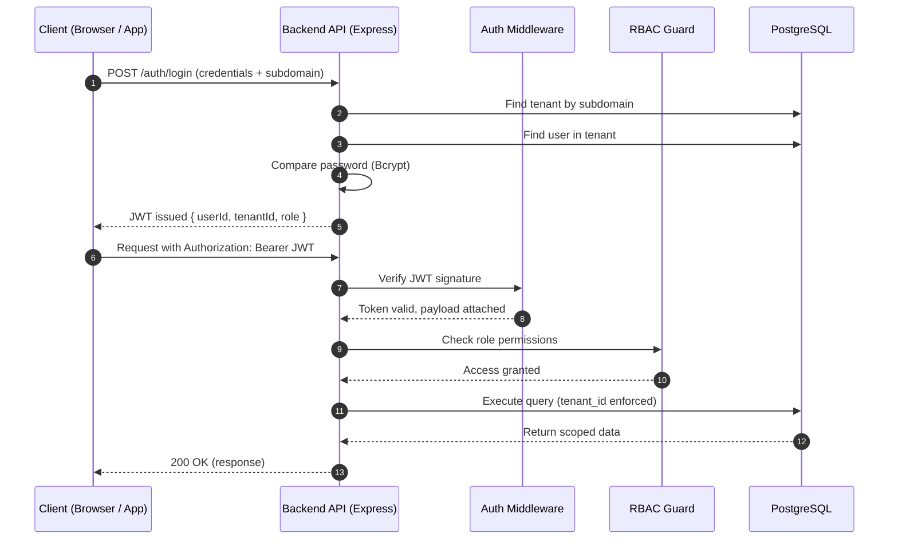

# Research Document: Multi-Tenant SaaS Platform Architecture

**Project Name:** Multi-Tenant SaaS Project Management System  
**Date:** October 26, 2025  
**Author:** AWS Student / Lead Developer  
**Status:** Approved for Implementation  

---

## 1. Multi-Tenancy Architecture Analysis

Multi-tenancy is the architectural capability of a single instance of software to serve multiple distinct user groups, known as **tenants**. In a SaaS context, this means one codebase serving many customer organizations simultaneously.

The most critical architectural decision in building a SaaS platform is the **database design strategy**, as it directly impacts scalability, isolation, maintenance complexity, and cost.

Below is a detailed analysis of the three primary approaches considered.

---

### A. Shared Database, Shared Schema (Discriminator Column)

Also known as the **Pool Model**.  
All tenants share the same database and schema. Data isolation is achieved using a discriminator column such as `tenant_id`.

**Mechanism**
- Every table includes a `tenant_id`
- Every query includes `WHERE tenant_id = ?`
- Isolation is enforced at the application layer

**Pros**
- Lowest infrastructure cost
- Instant tenant onboarding
- Simple DevOps (single DB)
- Easy cross-tenant analytics

**Cons**
- High risk of data leaks if a query misses `tenant_id`
- Difficult per-tenant backups
- Noisy-neighbor performance risk

---

### B. Shared Database, Separate Schemas (Schema-per-Tenant)

Also known as the **Bridge Model**.  
Each tenant gets a dedicated schema (`tenant_a.users`, `tenant_b.users`).

**Mechanism**
- Database search path is set dynamically per request
- Queries are schema-isolated automatically

**Pros**
- Stronger isolation than shared schema
- Easier per-tenant backups
- Possible tenant-level customization

**Cons**
- Migration complexity grows linearly with tenants
- Schema catalog bloat
- Slower deployments at scale

---

### C. Separate Databases (Database-per-Tenant)

Also known as the **Silo Model**.  
Each tenant has a fully isolated database.

**Mechanism**
- A catalog/router maps tenants to database connections

**Pros**
- Maximum security and isolation
- No noisy-neighbor effect
- Ideal for regulated industries

**Cons**
- Extremely high cost
- Complex DevOps
- Poor fit for freemium SaaS

---

### Comparison Summary

| Feature | Shared Schema | Separate Schema | Separate Database |
|------|---------------|-----------------|------------------|
| Isolation | Low | Medium | High |
| Cost Efficiency | High | Medium | Low |
| Onboarding Speed | Instant | Fast | Slow |
| DevOps Effort | Low | Medium | High |
| Data Leak Risk | High | Medium | Very Low |
| Maintenance | Easy | Hard | Very Hard |
| Scalability | Vertical | Vertical | Horizontal |

---

### Chosen Approach: Shared Database + Shared Schema

**Justification**

1. **MVP Scope**  
   Focuses development effort on core SaaS features instead of infrastructure orchestration.

2. **ORM Compatibility (Prisma)**  
   Prisma works best with a single schema and discriminator pattern.

3. **Dockerized Evaluation**  
   Works cleanly with Docker Compose and one-command deployment.

4. **Risk Mitigation**  
   Tenant isolation is enforced via middleware that injects `tenant_id` automatically, eliminating developer error.

---

## 2. Technology Stack Justification

### Backend: Node.js + Express

**Why**
- Non-blocking I/O for high concurrency
- Middleware-driven tenant isolation
- Single language across stack

**Rejected**
- Django (sync & rigid ORM)
- Spring Boot (heavy runtime)

---

### Frontend: React (Vite)

**Why**
- Component reusability
- Fast re-rendering via Virtual DOM
- Rich ecosystem (Router, Axios)

**Rejected**
- Angular (steep learning curve)

---

### Database: PostgreSQL

**Why**
- Strong relational integrity
- Cascade deletes
- JSONB flexibility
- Future-ready with Row-Level Security

**Rejected**
- MongoDB (weak relational guarantees)

---

### Authentication: JWT

**Why**
- Stateless scalability
- Works across subdomains
- No shared session store required

**Rejected**
- Server-side sessions (Redis dependency)

---

### Deployment: Docker & Docker Compose

**Why**
- Environment parity
- One-command deployment
- Simple service orchestration

---

## 3. Security Considerations

### Measure 1: Middleware-Based Tenant Isolation

- JWT is validated on every request
- `tenant_id` is injected server-side
- Controllers never trust client-supplied tenant identifiers

---

### Measure 2: Secure Password Storage

- Passwords hashed with **Bcrypt**
- Salt rounds ≥ 10
- Defends against rainbow table attacks

---

### Measure 3: Role-Based Access Control (RBAC)

| Role | Capabilities |
|----|-------------|
| Super Admin | Global access |
| Tenant Admin | Full tenant control |
| User | Limited access |

Route guards enforce permissions before DB access.

---

### Measure 4: API Hardening

- Strict CORS rules
- Rate limiting for login
- Helmet security headers

---

### Measure 5: Input Validation & ORM Safety

- Input validated using schemas
- Prisma parameterized queries
- Eliminates SQL Injection risk

---

### Data Isolation Strategy (Row-Level Pattern)

- `tenant_id` present in all tenant-owned tables
- Queries always scoped:
  ```sql
  SELECT * FROM tasks
  WHERE id = :taskId
  AND tenant_id = :jwtTenantId;
```

Unauthorized access returns **404 Not Found**, making foreign tenant data completely invisible to the requester.

---

## Authentication & Authorization Flow

1. **User Login**  
   The user logs in using their credentials along with the tenant subdomain.

2. **Tenant & User Validation**  
   The backend resolves the tenant using the subdomain and validates the user credentials within that tenant.

3. **JWT Issuance**  
   Upon successful authentication, the backend issues a signed JWT containing:
   ```json
   {
     "userId": "<uuid>",
     "tenantId": "<uuid>",
     "role": "<role>"
   }
```

4. **Authenticated Request**

The client includes the JWT in the `Authorization` header for all subsequent protected API requests:

```bash
Authorization: Bearer <token>
```

5. **Token Validation**

Authentication middleware verifies the JWT signature and decodes the payload using the server’s secret key.  
If the token is valid, the extracted claims are attached to the request context for downstream processing.

---

6. **Authorization (RBAC)**

Role-Based Access Control (RBAC) guards evaluate the user’s role embedded in the JWT and determine whether access to the requested route is permitted.

- Authorization checks are executed **before** any business logic runs
- Unauthorized requests are blocked early
- Ensures strict least-privilege access across the system

